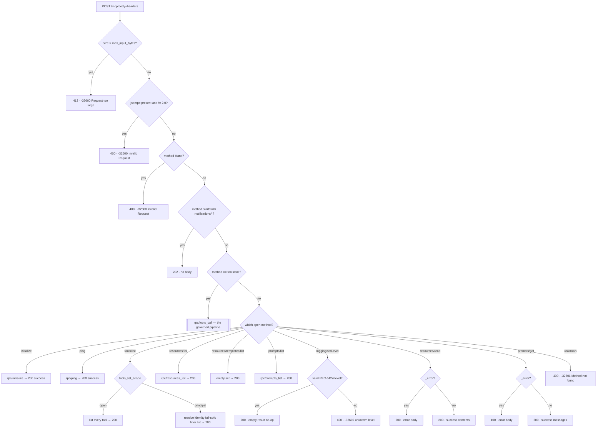
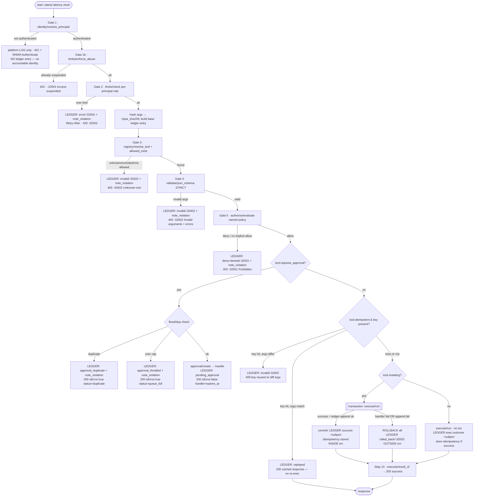

# Request Flow — from an agent's call to the response

**Scope:** the complete lifecycle of a single request against the governed MCP endpoint, traced against the real code in `modules/mcp/public/`. Every stage, every branch, every exit path, and what gets written to the ledger at each one.

**Entry point:** `POST /mcp` → `views/pages/mcp.json.liquid` → `commands/rpc/dispatch` → (for tool calls) `commands/rpc/tools_call`.

Read this top-to-bottom: first the 30-second map, then the two flow diagrams, then the step-by-step narration where each exit is spelled out.

---

## 0. The 30-second map

```
Agent  ──HTTP POST /mcp (JSON-RPC 2.0, Bearer token)──►  mcp.json.liquid  (marshals HTTP)
                                                              │
                                                        rpc/dispatch      (envelope + routing)
                                                        ┌─────┴─────────────────────┐
                                          OPEN methods  │                           │  tools/call
                             (initialize, ping,         │                           │  (the governed path)
                              tools/list, resources/*,  │                           ▼
                              prompts/*, logging)       │                    rpc/tools_call
                                                        ▼                    ┌──────────────┐
                                              handled inline,                │  8 gates,    │
                                              result or error,               │  fail-closed │
                                              mostly no ledger               └──────┬───────┘
                                                                                    ▼
                                                                            JSON-RPC response
                                                                        (+ a ledger entry, always)
```

Two families of methods leave `dispatch`:

- **Open methods** — discovery and plumbing (`initialize`, `ping`, `tools/list`, `resources/list`, `resources/read`, `resources/templates/list`, `prompts/list`, `prompts/get`, `logging/setLevel`). No Bearer token required; **listing is not executing.** These do *not* write to the hash-chained ledger (they take no action). `tools/list` can optionally resolve identity to *filter* what it advertises, but never blocks.
- **`tools/call`** — the one path that can cause a side effect, and therefore the one path that runs every governance gate and writes a ledger entry for **every** authenticated outcome.

Everywhere below, one rule holds: **fail-closed.** Any check that cannot conclusively say "allow" ends the request as deny / invalid / error — never as an accidental allow.

---

## 1. Before the request: how the agent got a token

The agent is not anonymous. A human first signs in to the instance (existing user/OAuth login), opens `/mcp-tools`, and mints a Bearer via `commands/tokens/mint`. That command:

- generates a random raw token,
- stores **only its `sha256` digest**, bound to the human's `user_id` (+ an optional `label` and `allowed_tools` scope),
- returns the raw token **once**.

So by the time a request arrives, the token on the wire maps to a **real platformOS user**, and the stored side of that mapping is a digest that cannot be reversed into a working credential. This is the root of the identity plane — everything downstream reasons about *that user* (the "principal"), not about the agent's own say-so.

---

## 2. HTTP entry — `views/pages/mcp.json.liquid`

A `method: post, format: json` page. It does no logic; it is the HTTP marshaller:

1. Calls `rpc/dispatch` with `context.params` (parsed JSON body merged with query) and `context.headers`.
2. Sets the HTTP status from `out.http_status` (default 200).
3. Sets any response headers from `out.headers` (e.g. `WWW-Authenticate`, `Retry-After`).
4. `echo`es `out.body` — the JSON-RPC envelope — unescaped. For a `202` notification there is no body.

Everything of substance happens in `dispatch` and below.

---

## 3. Dispatch — `commands/rpc/dispatch`

Pure orchestration: validate the envelope, enforce the transport size cap, route the method. Here is every branch, in order.



Notes on the dispatch branches:

- **Size cap first.** `input_bytes = params | json | size` is checked against `cfg.defaults.max_input_bytes` *before any other work*, so an oversized body is cheap to reject (`413`, `-32600`).
- **Envelope validation.** `jsonrpc`, if present, must be exactly `"2.0"`; a missing `method` is `Invalid Request`. Both are `400 / -32600`.
- **Notifications** (`notifications/*`) are acknowledged with `202` and **no body** — JSON-RPC notifications expect no response.
- **`tools/call`** hands off the whole outcome (status/headers/body) to `rpc/tools_call` (section 4).
- **Open methods** are wrapped in a success envelope and returned `200`. Two of them can carry a structured `_error` (unknown resource / unknown prompt): `resources/read` returns the error at `200`, `prompts/get` at `400`.
- **`tools/list` scoping.** With `tools_list_scope: 'open'` (default) it lists everything. With `'principal'` it resolves identity *fail-soft* (`resolve_principal` returns a deny object, never throws): an authenticated caller sees only the tools they may call; an unauthenticated caller resolves to the `anonymous` scope and is advertised nothing. Discovery never returns `401`.
- **`logging/setLevel`** is a deliberate open no-op — but it still validates `level` against the RFC-5424 set; garbage input is `400 / -32602`, never a silent `{}`.
- **Unknown / not-yet-implemented method** → `400 / -32601 "Method not found"`. The surface never lies about what it implements.

None of the open-method branches write to the hash-chained ledger — they take no governed action.

---

## 4. The governed pipeline — `commands/rpc/tools_call`

This is the spine. It runs eight gates in a fixed order; **any gate can end the request**, and every authenticated ending writes exactly one ledger entry (the rate-limit and abuse paths are the only ones with an extra note). The order is not negotiable — nothing reaches execution having skipped a gate.



### Gate-by-gate

**Clock.** First line stamps a unix-ms `start_ms` onto the ledger entry as `_start_ms`; `ledger/append` derives `duration_ms` from it. Latency is measured across the whole pipeline.

**Gate 1 — Identity (`identity/resolve_principal`).** Verifies the Bearer token and maps it to `{ principal, agent, delegation_mode:'direct', token_id }`. Fail-closed cascade, each returning a distinct stable `reason`:
- no/malformed `Authorization: Bearer` → `401`, `reason: missing_token` / `empty_token`, `WWW-Authenticate: …`
- digest not found → `401`, `unknown_token`
- token `status != active` (revoked/suspended) → `401`, `token_revoked`
- token not bound to a user → `401`, `token_unbound`

**Key policy — pre-auth failures are NOT ledgered.** On any of the above, `tools_call` writes to the **platform log only** (`log auth.reason, type:'mcp.auth_denied'`) and returns the `401`. There is no accountable identity, so anonymous probes can't spam or grow the tamper-evident chain (that would be a DoS / integrity-noise vector). Every gate *after* this point has an authenticated identity and *does* ledger. On success, the token's `last_used_at` is best-effort stamped (throttled to ≤1 write/min/token).

**Gate 1b — Abuse auto-suspend (`limits/enforce_abuse`).** Reads the principal's O(1) windowed violation counter. If it has crossed the threshold, the command **revokes the token** (status → suspended) and writes a `security/suspend` ledger entry, and this call returns `403 / -32001 "Access suspended"`. Every subsequent call then fails Gate 1 as `token_revoked`. This is a real containment control, not a warning — and it never scans the ledger on the hot path (an earlier version did and blew the per-request budget).

**Gate 2 — Rate limit (`limits/check`, scope `principal:<id>`).** Fixed per-minute window against `cfg.defaults.rate_limit_per_min`. Over the limit: **write a ledger entry** (`execution_outcome: error`, `error_code: -32002`), call `note_violation` (feeding Gate 1b), set `Retry-After`, and return `429 / -32002`. This is the first *authenticated* exit, so it *is* ledgered.

**Argument hashing.** Past the limits, the arguments are serialized and `input_sha256 = sha256(args_json)` is computed. **Raw arguments are never stored** — only the digest + byte count go into the ledger (plus any handler-declared `audit_json`). A `request_id` (uuid) and the base ledger entry `le` are assembled here and filled in per outcome.

**Gate 3 — Registry resolve (`registry/resolve_tool`).** Looks the tool name up in the built registry, applying the token's `allowed_tools` narrowing (intersect only). A name that is unregistered, excluded (its manifest failed meta-validation at build), or outside this token's `allowed_tools` → **not found** → ledger (`invalid`, `-32602`) + `note_violation` + `400 / -32602 "Unknown tool"`. The surface can never execute an unvalidated action.

**Gate 4 — Argument validation (`validate/json_schema`, STRICT).** Validates the arguments against the tool's `input_schema`: no type coercion (`"42"` ≠ integer `42`), unknown keys rejected, `additionalProperties` forced false, depth capped at `max_schema_depth`. Invalid → ledger (`invalid`, `-32602`) + `note_violation` + `400 / -32602 "Invalid arguments"` **with `data.validation_errors`** (which key / which constraint — safe for the agent to self-correct, no server internals).

**Gate 5 — Authorization (`authorize/evaluate`).** Evaluates the tool's named policy for the resolved principal (in `on_behalf_of` mode the authoritative subject is the human, never the agent). Returns boolean or `{allow, reason}`; the `reason` is recorded to the ledger regardless. **No implicit allow** — a policy that doesn't say yes is a no. Deny → ledger (`authz_decision: deny`, `execution_outcome: denied`, `-32001`) + `note_violation` + `403 / -32001 "Forbidden"` (generic wire message; the specific reason stays in the ledger). Allow → `authz_decision: allow`, continue.

**Gate 6 — Approval gate (only if `tool.requires_approval`).** A tool marked `requires_approval` **never executes inline.** First a flood-control guard counts this principal's non-expired pending proposals:
- **exact duplicate** (same `input_sha256` already pending) → `note_violation`, ledger `approval_duplicate`, and a *tool-level* result (`200`, `isError:true`, `status:duplicate`) telling the agent to poll the existing handle. (Tool error, not protocol error — HTTP 200.)
- **over `approval_max_pending_per_principal`** → `note_violation`, ledger `approval_throttled`, `200 isError:true status:queue_full`. Repeat flooding trips Gate 1b.
- **otherwise** → `approval/create` persists the intent (arguments *are* stored here, since execution is deferred), ledger `pending_approval`, and returns `200 isError:false` with an opaque `handle` + `expires_at`.

Idempotency does **not** apply on this branch — the handle is the dedup, and there is no result yet. Deferred execution is section 5.

**Gate 7 — Idempotency (only if `tool.idempotent` and a `_meta.idempotencyKey` was supplied).** Runs *after* authorization, so a cached result is never served to an unauthorized caller. Lookup by `(key, principal)`:
- **hit, but `input_sha256` differs** → same key, different args = client error → ledger (`invalid`, `-32602`) + `409 / -32602 "Idempotency-Key reused with different arguments"`.
- **hit, args match** → **replay** the stored result without re-executing → ledger `replayed` → `200` with the cached response.
- **miss** → mark `idem_store = true` and fall through to execution (the result will be stored).

**Gate 8 — Execution + attestation.** Two shapes:

- **Mutating tool** — handler and ledger share **one transaction**:
  ```
  transaction
    exec = execute/run(...)
    if exec.outcome == success
        le.execution_outcome = success (+ subject_type/subject_id)
        if idem_store: idempotency/store   ← INSIDE the txn
        ledger/append                      ← INSIDE the txn
        if append succeeded: commit  else: rollback
    else
        rollback
  endtransaction
  unless committed:
        ledger/append(rolled_back, -32003) ← OUTSIDE the txn, so the failure is still audited
  ```
  The mutation, its idempotency record, and its attestation **commit or roll back together** — an action can never exist without its attestation, and a rolled-back call leaves no idempotency record (so a genuine retry re-executes). A handler failure *or* a failed ledger append rolls the whole thing back; the `rolled_back` outcome is then recorded outside the transaction so the failure is never invisible.

- **Read-only tool** — no transaction: `execute/run`, record `exec.outcome` (+subject) to the ledger, and if `idem_store` and success, store the idempotency record.

**Step 10 — Respond.** `execute/result_of` builds the single canonical MCP result (the same shape used for the idempotency cache, so a replay is byte-identical). A handler *business* error is an MCP **tool error** (`isError:true`) — **not** a protocol error — so a protocol-successful call returns `HTTP 200` either way. Internals never leak; only the handler's stable `error.message` surfaces.

---

## 5. Deferred path — an approved action runs later

A `pending_approval` from Gate 6 sits until an operator decides in the console (`views/pages/mcp-admin/approve.liquid` → `commands/approval/execute`). Approval is **not** a rubber stamp — `approval/execute` re-enters the pipeline as the **original principal**:

1. re-resolve the tool (it may have been de-registered or changed),
2. re-validate the stored arguments against the *current* schema,
3. **re-authorize** against the original principal (rights or policy may have changed since the request),
4. execute inside a transaction and **attest**, linked to the original request by `request_id`.

The operator only *decides*; the action runs with the requester's identity and scope, never the operator's. An expired or already-decided approval cannot execute. The agent learns the outcome by polling `mcp_approval_status` (self-scoped: unknown handle and someone-else's handle both return an identical "not found", so handles can't be enumerated).

---

## 6. What lands in the ledger — the outcome taxonomy

Every authenticated ending writes one chained entry (`ledger/append`: stamps `seq` + `occurred_at`, links `prev_entry_hash`, hashes the canonical payload). The `execution_outcome` tells you exactly where the request ended:

| `execution_outcome` | `authz_decision` | error code | HTTP | Where it ended |
|---|---|---|---|---|
| `error` (rate) | `not_applicable` | `-32002` | 429 | Gate 2 rate limit |
| `invalid` | `not_applicable` | `-32602` | 400 | Gate 3 unknown tool **or** Gate 4 invalid args **or** Gate 7 key-reuse (409) |
| `denied` | `deny` | `-32001` | 403 | Gate 5 authorization |
| `approval_duplicate` | `allow` | — | 200 | Gate 6 dedup |
| `approval_throttled` | `allow` | — | 200 | Gate 6 queue full |
| `pending_approval` | `allow` | — | 200 | Gate 6 queued for operator |
| `replayed` | `allow` | — | 200 | Gate 7 idempotent replay |
| `success` | `allow` | — | 200 | Gate 8 executed & committed |
| `rolled_back` | `allow` | `-32003` | 200* | Gate 8 mutating handler/append failed |
| `security/suspend` | `deny` | — | 403 | Gate 1b auto-suspend (separate entry) |

\* A `rolled_back` mutation still returns the handler's tool-error result (`isError:true`, HTTP 200) — the *protocol* call succeeded; the *action* did not.

**Not in the ledger:** pre-auth failures (bad/missing/revoked/unbound token) — platform log only. And the open methods (`initialize`, `ping`, `tools/list`, `resources/*`, `prompts/*`, `logging/setLevel`) — they take no governed action.

Only `input_sha256` and the chain hashes are hashed; everything else (tool name, principal, outcome, timings, declared `audit_json`) is plaintext, so the ledger is *readable* — `verify_chain` proves it wasn't altered, and the operator console + metrics read it directly.

---

## 7. The whole picture in one sentence

> One HTTP door (`mcp.json.liquid`) → one router (`rpc/dispatch`) that answers open/discovery methods inline → one governed spine (`rpc/tools_call`) that runs identity → abuse → rate → registry → validation → authorization → (approval | idempotency) → transactional execution, fail-closed at every gate, and attests every authenticated outcome to a hash-chained ledger — while pre-auth noise is turned away at the log, never the chain.

---

### Cross-references
- Per-command reference (what each partial is and why): `engine-commands-architecture.md`
- Normative spec (section numbers cited in the code): `pos-module-mcp-spec.md`
